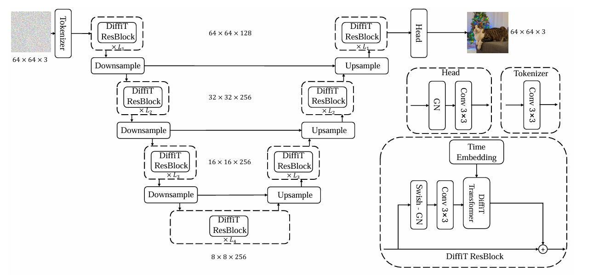
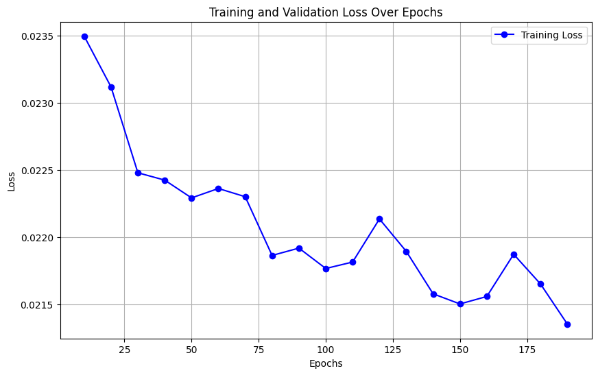

# DiffiT Reimplementation

The presented project is a detailed re-implementation of the paper "DiffiT: Diffusion Vision Transformers for Image Generation".
The papers presents a new method to handle the diffusion process of generative neural networks. In particular, it introduecs a new attention mechanism which preserves temporal information and shows two architectures in which this can be used.

## TAMSA and DiffiT block

The key component of the proposed architectures is the Time-aware Multi-Head Self-Attention ( TMSA ), an alternative attention mechanism that combines both the spatial tokens ( classical of the vision transformers ) and the time token of the diffusion process.
The intuition is that the described information should not be lost along the architecture layers, so it's fed in every step in which the TMSA is used.
The key, query and values are computed by using 2 different weight matrices, one for the spatial tokens and one for the temporal tokens ( which may include label inforamtion ).

$$q_s = x_sW_{qs} + x_tW_{qt}$$
$$k_s = x_sW_{ks} + x_tW_{kt}$$
$$v_s = x_sW_{vs} + x_tW_{vt}$$

where $W_{qs}$, $W_{qt}$, $W_{ks}$, $W_{kt}$, $W_{vs}$ and $W_{vt}$ denote spatial and temporal linear projection weights for their corresponding queries, keys and values respectively.

Denoting with $Q=\{q_s\}$, $K=\{k_s\}$ and $V = \{v_s\}$, the self-attention is computed as follows:

$$ \text{Attention}(\mathbf{Q}, \mathbf{K}, \mathbf{V}) = \text{Softmax} \left( \frac{\mathbf{Q} \mathbf{K}^\top}{\sqrt{d}} + \mathbf{B} \right) \mathbf{V} $$

This new mechanism is used in the DiffiT block, an innovative transformer block.

$$ \hat{x}_s = \text{TMSA} ( \text{LN}(x_s),x_t) + x_s $$
$$ x_s = \text{MLP} ( \text{LN}(\hat{x}_s)) + \hat{x}_s $$

## Presented architectures
The paper show how the DiffiT block can be used in two different architectures, an Image Space and a Latent Space model.

### IMAGE SPACE MODEL
The image space model is implemented with an U-Net like architecture with residuals, where:
*   The input image is tokenized in a feature map.
*   Each level of the network is  a sequence of DiffiT Residual blocks.
*   The final feature is decoded with a head.

  

### LATENT SPACE MODEL
The latent space model is a simple variation of the Vision Transformer model. Instead of working directly with images, it works with a latent reppresentation of a pre-trained autoencoder model.
The architecture is composed by the following - sequential - layers:
1. Encoder layer: from the autoencoder, to obtain the latent reppresentation of the image. It's applied before the noisification of the image.
2. Patch embedding layer: the image is pachified and learnable positional embedding is summed.
3. N layers of Latent DiffiT modules: in the orginal implementation 30 layers are used.
4. Final layer: to re-obtain the original number of features of the feature map. It's a linear layer.
5. Unpatchify layer: to bring the feature map to the original shape.
6. Decoder layer: from the autoencoder, to obtain an image from the latent reppresentation. It's applied during the backtracking phase only during inference time.

  

## Training

### Datasets
In the paper, the two DiffiT architectures are trained with two different datasets:
- **Latent space** is trained on ImageNet256 with 50% of the total classes;
- **Image space** is trained on CIFAR-10, which consists of 60K of 32x32 color images in 10 classes, with 6K images per class. There are 50K training images and 10K test images.

### Hardware adaptation and SmoothL1Loss
The available hardware for the paper reimplementation was insufficient for an exact recreation, so the datasets and the parameters have been downscaled significantly. Despite these sacrifices, we were not able to train the Latent Space Model, being too computationally and memory-wise expensive.
In order to obtain good results, we reduced the dimension of the two models, changing some hyperparameters, and we modified the loss function, using the *SmoothL1Loss*. It smoothly transitions from L1 (absolute error) to L2 (squared error) loss depending on the magninute of the error, balancing the benefits of both. In particular:
- for **small errors**, it behaves like **L2 loss**, which provides a stable grandient;
- for **large errors**, it behaves like **L1 loss**, which is less sensitive to outliers.

It is useful in our context because stabilize the training, makes it faster and more robust to noisy data.

### Results
Despite the adaptations, the model training reached decent results.

  

The qualitative results demonstrate the model’s ability to generate images of different classes effectively.

  

## Try the model!
The following steps to try the model are:
1. Downlaod the file 'DiffiT_reimplementation.ipynb' and load it on google colab.
2. Run the following cells in order to download the required dependencies and to load the required classes:
   a. SUPPORT CODE
   b. DIFFUSION MODELS
   c. CREATION OF EMBEDDINGS
   d. TMSA
   e. DIFFIT BLOCK
   f. IMAGE SPACE MODEL
   g. DATASET PREPARATION
   h. MODEL LOADING
3. 
